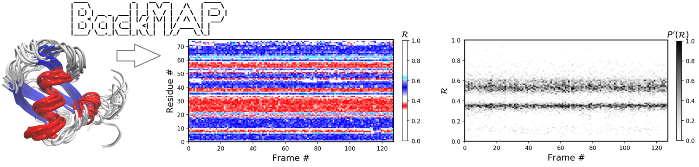

.. contents::

.. section-numbering::

Introduction
============

This tool provides easily readable "pictures" of protein conformations, 
ensembles, and trajectories saved as either a combined protein databank 
(PDB) structure file, or a directory of such files, and produces graphs.

Installation
============

PIP Installation
-----------------

Running the following at command line would get the job done (the '-I' is not necessary, but ensures the latest sub-version is installed):

.. code-block:: bash

    $ pip install -I backmap

GIT Installation
----------------

.. code-block:: bash

    $ git clone https://github.com/ranjanmannige/backmap.git
    $ cd backmap
    $ python setup.py install
    $ python setup.py test

Usage
=====

In-script usage
---------------

.. code-block:: python

    import backmap as bm
    print bm.R(phi=0,psi=0)

For more information about module usage, refer to the `manuscript <./manuscript/manuscript/plotmap.pdf>`_ associated with this module

Standalone usage
----------------

After installation, the following commands produce a variety of graphs (exampled below).

.. code-block:: bash

    python -m backmap.__init__ -pdb ./pdbs/ProteinDatabankStructureFilename.pdb
    python -m backmap.__init__ -pdb /directory/containing/pdbs/
    
The .__init__ is needed because the main file we are referencing is backmap/__init__.py.

Examples
========

Example 1: A stable protein (`1xqq <https://www.rcsb.org/structure/1XQQ>`_)
------------------------------------------------------------------------------

The Panels **(b)** through **(f)** were created by running the following command within thin the downloaded directory (Panel **(a)** was created using `VMD <http://www.ks.uiuc.edu/Research/vmd/>`_.

.. code-block:: bash

    python -m backmap.__init__ -pdb ./tests/pdbs/1xqq.pdb

As evident below, the graphs generated from the protein ensemble `1xqq <https://www.rcsb.org/structure/1XQQ>`_ describes a conformationally stable protein (each graph is detailed below). 

    .. image:: ./manuscript/manuscript/figures/1xqq_spread.png

Each column in Panel **(b)** describes the histogram in Ramachandran number (R) space for a single model/timeframe. These histograms show the presence of both helices (at R \~ 0.34) and sheets (at R \~ 0.52). Additionally, Panels **(c)** and **(d)** describe the per-residue conformational plots (colored by two different metrics or CMAPs), which show that most of the protein backbone remains relatively stable (e.g., few fluctuations in state or 'color' are evident over the frame \#). Finally, Panel **(e)** describes the extent towards which a single residue's state has deviated from the first frame, and Panel **(f)** describes the extent towards which a single residue's state has deviated from its state in the previous frame. Both these graphs, as expected from the graphs above, show that this protein is relatively conformationally stable.

Example 2: An intrinsically disordered protein (`2fft <https://www.rcsb.org/structure/2FFT>`_)
----------------------------------------------------------------------------------------------

As compared to the conformationally stable protein above, an intrinsically disordered protein `2fft <https://www.rcsb.org/structure/2FFT>`_
is much more flexible

    .. image:: ./manuscript/manuscript/figures/2fft_spread.png

Panel **(b)** shows that the states accessed per model are diverse and dramatically fluctuate over the entire range of R (this is especially true when compared to a stable protein, see above). 

The diverse states occupied by each residue (Panels **(c)** and **(d)**) confirm the conformaational variation displayed by most residues (Panels **(e)** and **(f)** similarly show how most of the residues fluctuate dramatically).

Yet, interestingly, Panels **(c)** through **(f)** also show an unsusually stable region -- residues 15 through 25 -- which consistently display the same conformational (alpha-helical) state at R \~ 0.33 (interpreted as the color red in Panel **(c)**). This trend would be hard to recognize by simply looking at the structure (Panel **(a)**). 

Publications
============
The Ramachandran number concept is discussed in the following manuscripts (this tool is discussed in the first reference):

1. Mannige (2018) "The Backmap Python Module: How a Simpler Ramachandran Number Can Simplify the Life of a Protein Simulator" Manuscript Prepared. Preprint available 
the `manuscript/manuscript <manuscript/manuscript/plotmap.pdf>`_ subdirectory of this repo.

2. Mannige, Kundu, Whitelam (2016) "The Ramachandran Number: An Order Parameter for Protein Geometry" PLoS ONE 11(8): e0160023. 
Full Text: `https://doi.org/10.1371/journal.pone.0160023 <https://doi.org/10.1371/journal.pone.0160023>`_

